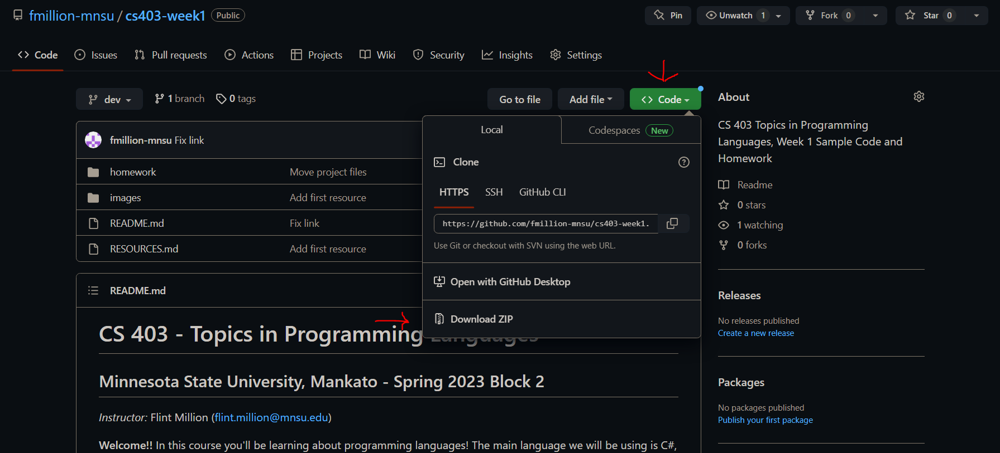

## Homework

Each week in this course you will complete a homework assignment. Each assignment should take you approximately 1-2 hours. You will write your homework in the C# programming language. The deliverable for each homework assignment will be a complete, zipped Visual Studio C# project that is ready to execute. *Please follow instructions carefully - while I will be manually grading your work, I will also be running your program code through an automated script* and if your program does not run correctly due to failure to follow all instructions, you may lose points. (We will discuss more on how I do this in Week 7!)

Many assignments will provide you with some code that you need to add on to or improve. Additionally, you are free to utilize code you have written for previous assignments as long as it is relevant to the current assignment. However, you **may not** use other students' code, even with permission - all code you submit for your assignments must be either provided in the assignment or **your own work**. You also may not simply copy/paste large blocks of code from the Internet or from books, online documentation, etc. A single line or two may be acceptable as long as you can *defend* that code (i.e. you can explain how it works and why it is written the way it is).

Each week you will look at this README file in the `homework` folder of the weekly code repository. The README file will outline the assignment's requirements and expectations, and will provide a grading rubric to help you gauge your own performance. 

### Week 1 Assignment

This week's homework will help get you familiar with Visual Studio and some basic C# code. It will also help you become familiar with the built-in numeric data types in C#. If you have worked with C# before, I expect this homework will be quite straightforward.

1. Download this week's repository by using the GitHub "Download ZIP" option, and extract the ZIP file to somewhere on your computer:

    

    > If you have experience with Git, you can also just clone the repository to your computer. However, you will not be submitting your homework via Git, so do not try pushing any code to the GitHub repository (it won't work anyway :D).

2. Open the Week1_Homework folder under the `homework` folder.
3. Open the file `Week1_Homework.sln`. This should open Visual Studio and open the project.
4. In the Solution Explorer, **click on the solution** (`Week1_Homework`) and **rename it to:** `week1_Firstname_Lastname`. For example, `week1_Flint_Million`. Click the solution in the Solution Explorer and press F2 to rename it.
5. Open the `Program.cs` file from the Solution Explorer and write the code as requested in the program file.
6. Once you have written, run and tested your code, make a **ZIP file** of the entire `Week1_Homework` folder. The ZIP file MUST either contain the files from inside the `Week1_Homework` folder or the `Week1_Homework` folder itself.
7. Submit the ZIP file on D2L. [This link](https://mnsu.learn.minnstate.edu/d2l/lms/dropbox/user/folder_submit_files.d2l?db=13720037&grpid=0&isprv=0&bp=0&ou=6192136) should take you to the assignment page.

#### Assignment Goals

* Be able to get into Visual Studio, open a project and work on it.
* Be able to print output to the console and receive interactive keyboard input from a user.
* Be able to convert string input representing numbers to numeric data types, and to test if that conversion was successful or not.
